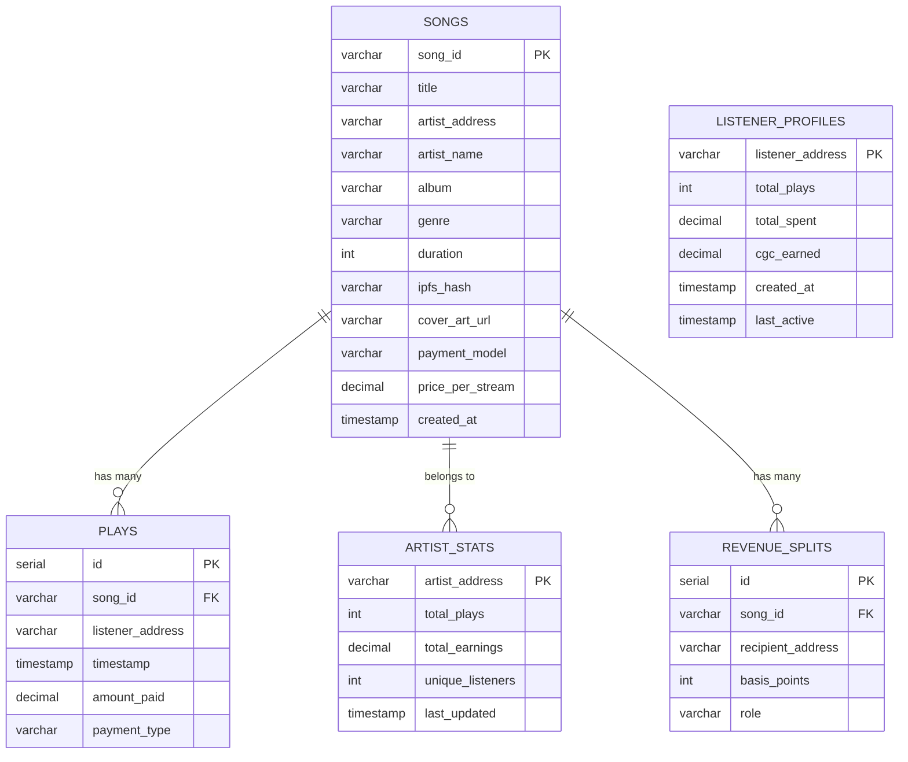
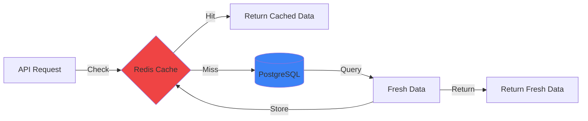

# Database Schema

Entity-Relationship diagrams for the Mycelix Music database.

## Entity-Relationship Diagram



## Table Schemas

### songs

| Column | Type | Constraints | Description |
|--------|------|-------------|-------------|
| song_id | VARCHAR(66) | PRIMARY KEY | Unique song identifier (0x...) |
| title | VARCHAR(255) | NOT NULL | Song title |
| artist_address | VARCHAR(42) | NOT NULL, INDEX | Artist's Ethereum address |
| artist_name | VARCHAR(255) | NOT NULL | Artist display name |
| album | VARCHAR(255) | | Album name |
| genre | VARCHAR(100) | NOT NULL, INDEX | Music genre |
| duration | INTEGER | NOT NULL | Duration in seconds |
| ipfs_hash | VARCHAR(100) | NOT NULL | IPFS content hash |
| cover_art_url | TEXT | | Cover art URL |
| payment_model | VARCHAR(50) | NOT NULL, INDEX | 'pay-per-stream' or 'gift-economy' |
| price_per_stream | DECIMAL(18, 8) | NOT NULL | Price in tokens |
| created_at | TIMESTAMP | NOT NULL, DEFAULT NOW(), INDEX DESC | Upload timestamp |

**Indexes:**
- `idx_songs_artist_address` on `artist_address`
- `idx_songs_genre` on `genre`
- `idx_songs_payment_model` on `payment_model`
- `idx_songs_created_at` on `created_at DESC`

### plays

| Column | Type | Constraints | Description |
|--------|------|-------------|-------------|
| id | SERIAL | PRIMARY KEY | Auto-increment ID |
| song_id | VARCHAR(66) | NOT NULL, FOREIGN KEY, INDEX | Song identifier |
| listener_address | VARCHAR(42) | NOT NULL, INDEX | Listener's address |
| timestamp | TIMESTAMP | NOT NULL, DEFAULT NOW(), INDEX DESC | Play timestamp |
| amount_paid | DECIMAL(18, 8) | NOT NULL | Amount paid in tokens |
| payment_type | VARCHAR(50) | NOT NULL | Payment model used |

**Indexes:**
- `idx_plays_song_id` on `song_id`
- `idx_plays_listener_address` on `listener_address`
- `idx_plays_timestamp` on `timestamp DESC`

### artist_stats

| Column | Type | Constraints | Description |
|--------|------|-------------|-------------|
| artist_address | VARCHAR(42) | PRIMARY KEY | Artist's Ethereum address |
| total_plays | INTEGER | NOT NULL, DEFAULT 0 | Total play count |
| total_earnings | DECIMAL(18, 8) | NOT NULL, DEFAULT 0 | Total earnings in tokens |
| unique_listeners | INTEGER | NOT NULL, DEFAULT 0 | Number of unique listeners |
| last_updated | TIMESTAMP | NOT NULL, DEFAULT NOW() | Last update timestamp |

### listener_profiles

| Column | Type | Constraints | Description |
|--------|------|-------------|-------------|
| listener_address | VARCHAR(42) | PRIMARY KEY | Listener's address |
| total_plays | INTEGER | NOT NULL, DEFAULT 0 | Total songs played |
| total_spent | DECIMAL(18, 8) | NOT NULL, DEFAULT 0 | Total spent in tokens |
| cgc_earned | DECIMAL(18, 8) | NOT NULL, DEFAULT 0 | CGC rewards earned |
| created_at | TIMESTAMP | NOT NULL, DEFAULT NOW() | Profile creation |
| last_active | TIMESTAMP | NOT NULL, DEFAULT NOW() | Last activity |

### revenue_splits

| Column | Type | Constraints | Description |
|--------|------|-------------|-------------|
| id | SERIAL | PRIMARY KEY | Auto-increment ID |
| song_id | VARCHAR(66) | NOT NULL, FOREIGN KEY | Song identifier |
| recipient_address | VARCHAR(42) | NOT NULL | Recipient's address |
| basis_points | INTEGER | NOT NULL | Share in basis points (0-10000) |
| role | VARCHAR(50) | NOT NULL | Role (artist, producer, etc.) |

**Constraint:** Sum of `basis_points` for a `song_id` must equal 10000

---

## Query Patterns

### Get Songs by Artist

```sql
SELECT * FROM songs
WHERE artist_address = '0x...'
ORDER BY created_at DESC;
```

**Uses index:** `idx_songs_artist_address`, `idx_songs_created_at`

### Get Top Songs by Play Count

```sql
SELECT
  s.song_id,
  s.title,
  s.artist_name,
  COUNT(p.id) as play_count
FROM songs s
LEFT JOIN plays p ON s.song_id = p.song_id
GROUP BY s.song_id
ORDER BY play_count DESC
LIMIT 10;
```

**Uses index:** `idx_plays_song_id`

### Get Artist Earnings

```sql
SELECT
  s.artist_address,
  s.artist_name,
  SUM(p.amount_paid * rs.basis_points / 10000) as earnings
FROM songs s
JOIN plays p ON s.song_id = p.song_id
JOIN revenue_splits rs ON s.song_id = rs.song_id
WHERE s.artist_address = '0x...'
  AND rs.recipient_address = s.artist_address
GROUP BY s.artist_address, s.artist_name;
```

### Get Listener History

```sql
SELECT
  p.timestamp,
  s.title,
  s.artist_name,
  p.amount_paid
FROM plays p
JOIN songs s ON p.song_id = s.song_id
WHERE p.listener_address = '0x...'
ORDER BY p.timestamp DESC
LIMIT 50;
```

**Uses index:** `idx_plays_listener_address`, `idx_plays_timestamp`

---

## Caching Strategy



**Cached Endpoints:**
- `GET /api/songs` - 30 second TTL
- `GET /api/songs/:id` - 60 second TTL
- `GET /api/artists/:address/stats` - 60 second TTL

**Cache Invalidation:**
- `POST /api/songs` - Clear `songs:all`
- `POST /api/plays` - Clear `songs:*` and `artist:*:stats`

---

## Database Optimization

### Connection Pooling

```javascript
const pool = new Pool({
  max: 20,                    // Max connections
  idleTimeoutMillis: 30000,   // 30 seconds
  connectionTimeoutMillis: 2000,
});
```

### Prepared Statements

```javascript
// Prevents SQL injection and improves performance
const query = {
  text: 'SELECT * FROM songs WHERE song_id = $1',
  values: [songId],
};
```

### Vacuum and Analyze

```bash
# Run periodically to optimize query planner
VACUUM ANALYZE songs;
VACUUM ANALYZE plays;
```

---

**Last Updated:** 2025-01-15
