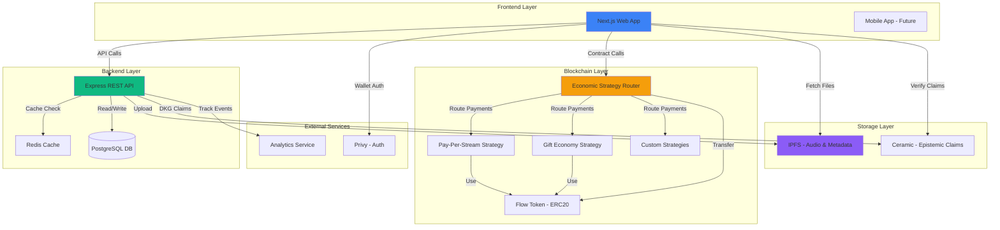
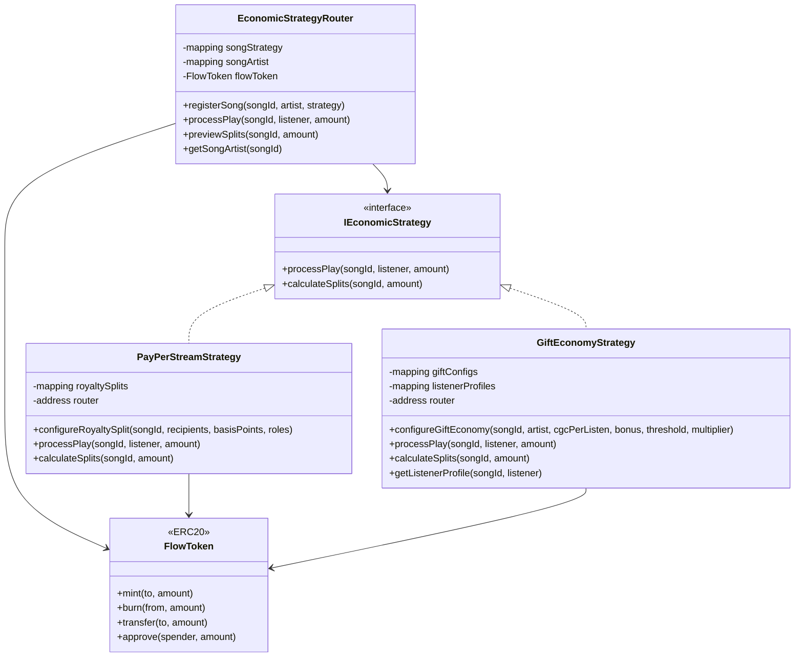
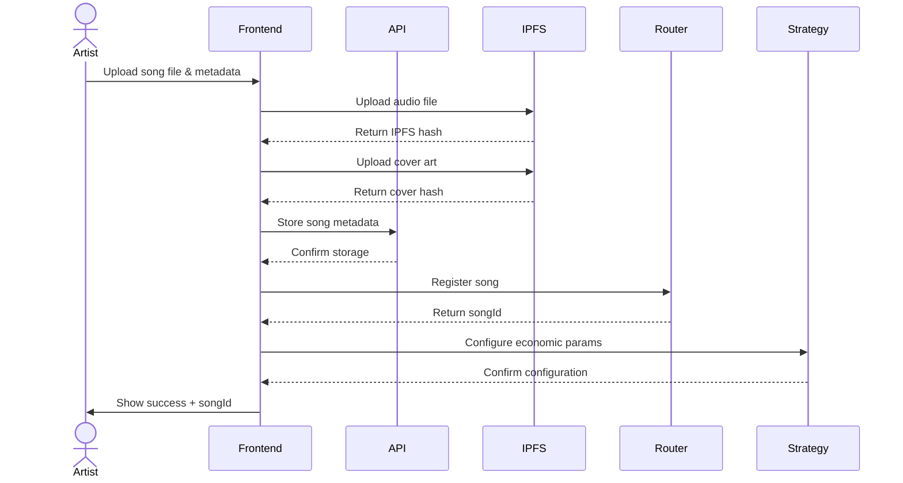
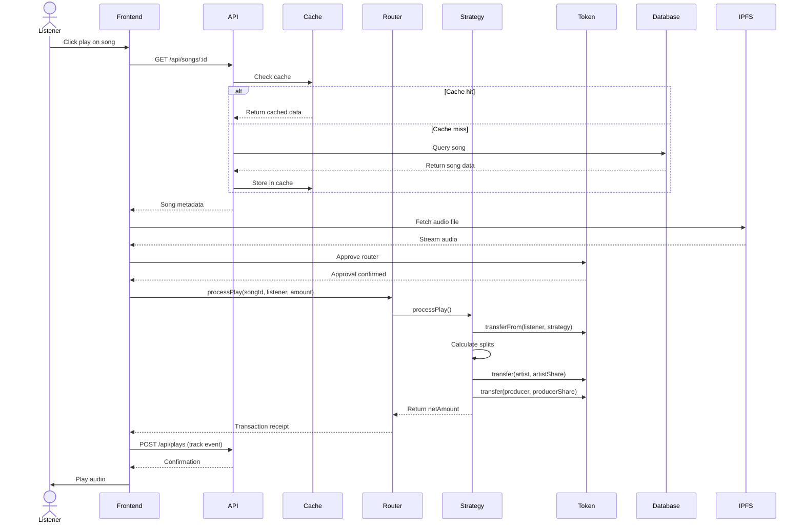
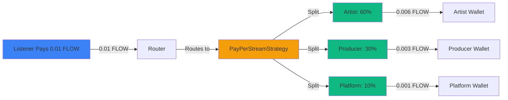
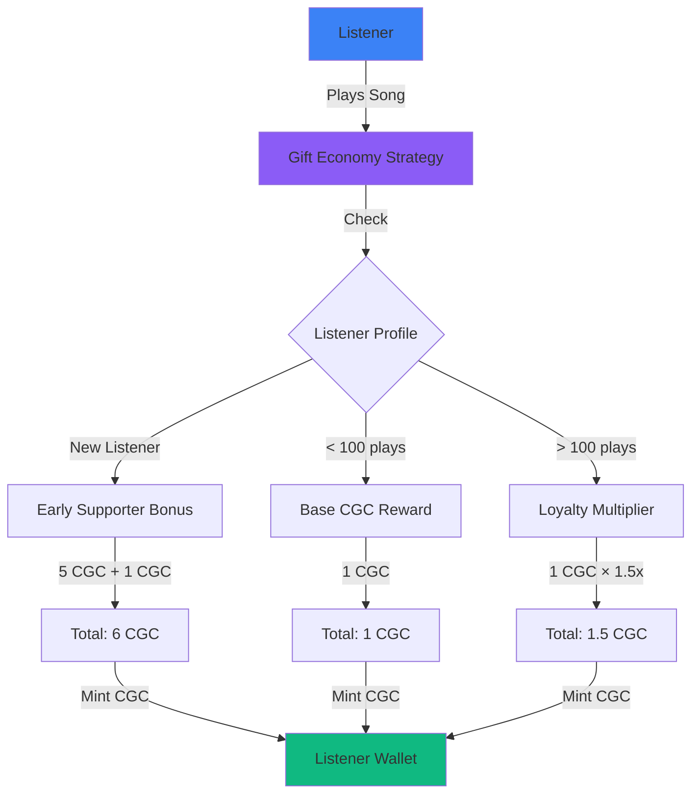
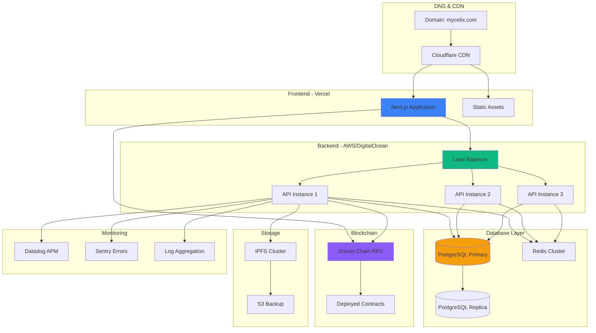
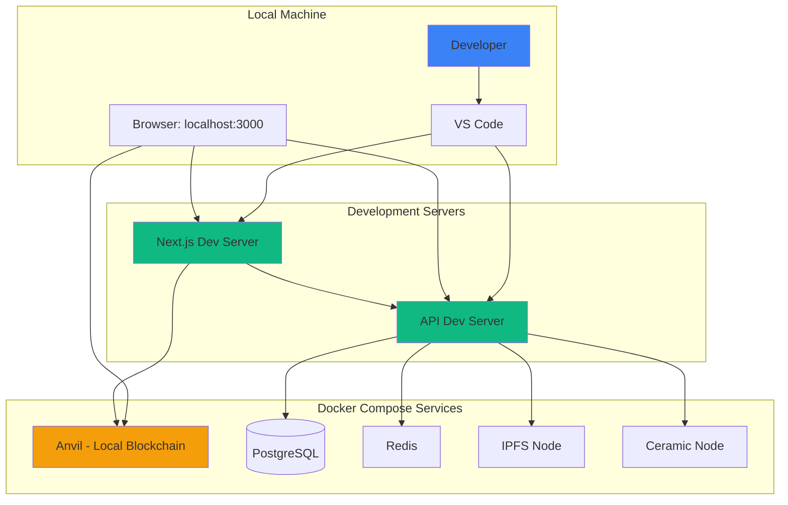
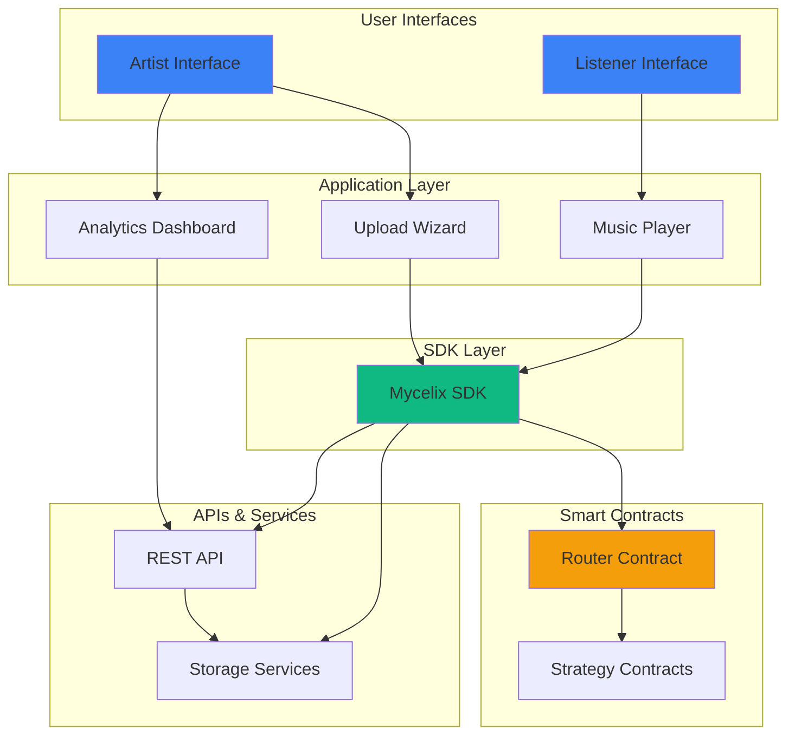

# System Architecture Diagrams

Visual representations of the Mycelix Music platform architecture.

## Table of Contents

- [High-Level Architecture](#high-level-architecture)
- [Smart Contract Architecture](#smart-contract-architecture)
- [Data Flow](#data-flow)
- [Payment Flow](#payment-flow)
- [Deployment Architecture](#deployment-architecture)

---

## High-Level Architecture

---

## Smart Contract Architecture

---

## Data Flow

### Song Upload Flow

### Song Playback Flow

---

## Payment Flow

### Pay-Per-Stream Payment Distribution

### Gift Economy Reward Flow

---

## Deployment Architecture

### Production Deployment

### Development Environment

---

## Component Interaction Diagram

---

## Notes

- All diagrams are rendered using Mermaid syntax
- View on GitHub or use a Mermaid-compatible viewer
- Diagrams are automatically rendered in most modern documentation platforms
- For high-resolution exports, use tools like [Mermaid Live Editor](https://mermaid.live/)

---

**Last Updated:** 2025-01-15
